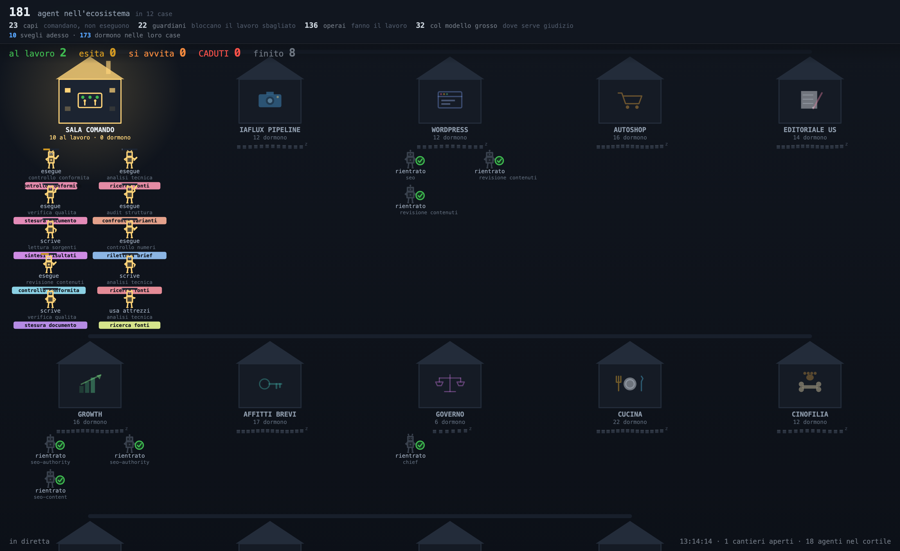

# Architettura multi-agente — iaFlux Studio

**181 agent specializzati, 19 domini, 22 gate con potere di blocco.**
Questo è il metodo con cui iaFlux Studio produce il proprio lavoro. Non è un prodotto in
vendita, non è un framework rilasciato: è documentazione di come lavoriamo, pubblicata
perché a chi valuta un fornitore serve poterla leggere.

- **[ARCHITETTURA.md](ARCHITETTURA.md)** — ruoli, routing, gate, catena di verifica,
  dove decide l'umano, gestione degli errori, limiti dichiarati
- **[ROSTER.md](ROSTER.md)** — i 181 contratti, per dominio, generati dai file reali

---

## Perché non basta un modello solo

Un modello generalista sa di fotografia di prodotto, di normativa, di sicurezza elettrica.
Il problema non è la competenza: è la **diluizione**. Quando un unico contesto contiene il
brief, i vincoli di marca, le regole di legge e la richiesta corrente, le istruzioni non
vengono ignorate — vengono *pesate male*. La regola che vale in un caso su cento è la prima
che si perde, ed è esattamente quella che serve.

Un contratto di specializzazione dichiara tre cose: cosa quell'agente possiede, cosa **non**
gli compete, e a chi passa il lavoro. Su 181 contratti, tutti e 181 dichiarano gli strumenti
a cui possono accedere — 88 non hanno alcun accesso di rete.

## Il pezzo che quasi nessuno pubblica: come ce ne accorgiamo quando si rompe

Ogni agente al lavoro è un robottino nella casa del suo dominio. La riga in alto è la verità
letta dal disco; **il disegno si adegua al numero vero, mai il contrario.** Se anche un solo
agente restasse fuori dal disegno, la plancia lo grida in rosso invece di nasconderlo.

*(Nella schermata le etichette del lavoro sono sostituite con descrizioni generiche: i titoli
veri sono nomi di progetti e di clienti. Struttura, ruoli e numeri sono quelli reali.)*

### I numeri che ci hanno fatto cambiare idea

**La soglia di caduta è 20 minuti, non 12.** Misurata su **1.624 agenti conclusi**: la pausa
più lunga fra due gesti supera 5 minuti nel 19,2% dei casi, 12 minuti nel 6,8%, 20 minuti nel
4,9%, 30 minuti nel 3,9%. A 12 minuti un agente sano su quindici veniva dichiarato morto.

**Su 114 agenti che sembravano caduti, 97 erano stati interrotti da una persona.** Solo 13
stavano davvero lavorando. Guardare l'orologio invece del motivo faceva gridare al lupo
cinque volte su sei.

> **Prima di dichiarare un guasto, leggi come è finita la cosa — non da quanto è ferma.**

**Un errore che vale la pena raccontare.** La prima versione classificava come «falliti» gli
agenti che restituivano meno di 40 caratteri. Su tutto l'archivio, i dieci «falliti» erano
gate che avevano risposto `{'verdict': 'PASS', 'defects': []}` — 34 caratteri, e lavoro
perfetto. *Una regola che premia la verbosità giudica lo stile, non l'opera.* Col criterio
corretto — conta se il risultato *c'è*, non quanto è lungo — l'archivio dà **1.928 rientri e
1.928 esiti, zero a mani vuote**.

### Come si riconosce un agente avvitato

Quattro sonde, tarate in produzione: la stessa chiamata ripetuta almeno quattro volte ·
dodici gesti uguali con non più di tre firme diverse · fermo oltre la soglia · trascrizioni
gemelle, che segnalano uno stallo di più agenti insieme.

## Cosa NON abbiamo

- **Nessun registro di audit cronologico.** Ci sono i verdetti conservati, con il motivo
  scritto e il responsabile della correzione. Non un log datato riga per riga.
- **Il tasso di respingimento dei gate è misurato su un solo cantiere completo, non in modo
  continuo.** Il 14 giugno 2026, su sedici testi arrivati ai controlli, quindici sono stati
  respinti al primo giro dal controllo della lingua, undici dal controllo dei claim, quattro da
  quello legale; numeri ricavati dai registri, in
  [La macchina che boccia il proprio lavoro](https://www.iaflux.it/la-macchina-che-boccia-il-proprio-lavoro/).
  La registrazione continua resta da fare.

Sono le due risposte oneste, e sono qui perché una pagina che rivendica controlli senza
dichiarare i propri buchi non è verificabile — è pubblicità.

## Limiti dichiarati

Gli agenti **non sono autonomi**: l'autonomia è deliberatamente limitata e le decisioni che
contano restano a una persona. C'è automazione di processo — code, temporizzatori, ripresa
dagli errori — e c'è la specializzazione del giudizio. Sono due cose diverse, con rischi
diversi, e confonderle è il modo tipico di costruire un'affermazione insostenibile.

## Portfolio e caso studio

Il sistema descritto in questo repository è quello che opera in produzione dietro [iaFlux Studio](https://www.iaflux.it).

- **[Portfolio](https://www.iaflux.it/portfolio/)** — nove sistemi, otto in produzione e uno collaudato, ciascuno con il cliente per nome e i numeri misurati.
- **[La macchina che boccia il proprio lavoro](https://www.iaflux.it/la-macchina-che-boccia-il-proprio-lavoro/)** — 69 agenti, 35 minuti, 16 testi ai controlli: 15 respinti al primo giro dal controllo della lingua. Nessun umano ha approvato un testo.

---

**iaFlux Studio** — NEW MULTISERVICE S.R.L.S., Caserta
Sito: <https://www.iaflux.it> · Contatto: studio@iaflux.it

Documentazione rilasciata con licenza [CC BY 4.0](LICENSE). I numeri di questo documento sono
stati ricontati il 26 agosto 2026; ogni aggiornamento riporta la data del nuovo conteggio.
Aggiornamento del 16 settembre 2026: sezione portfolio e caso studio, misura del tasso di respingimento su un cantiere; i conteggi dell'architettura restano quelli del 26 agosto.
